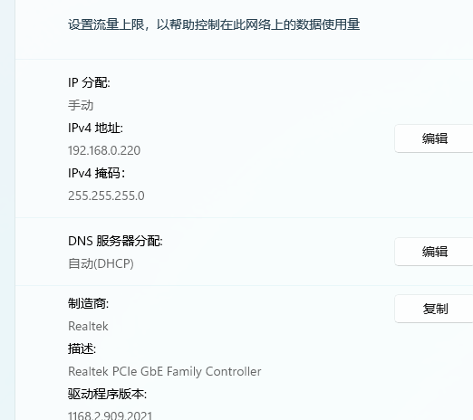
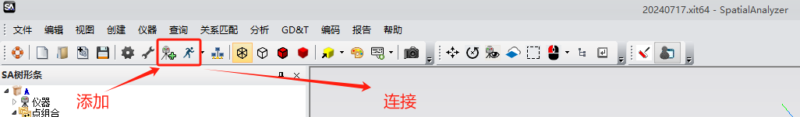
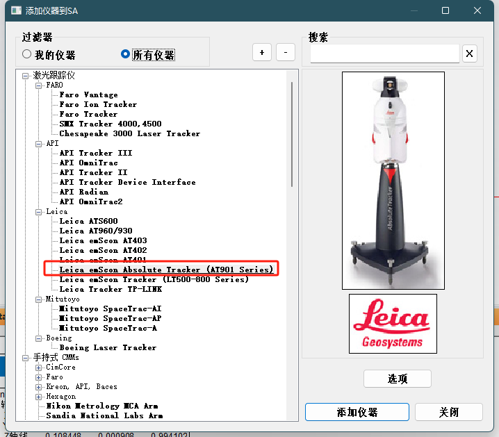
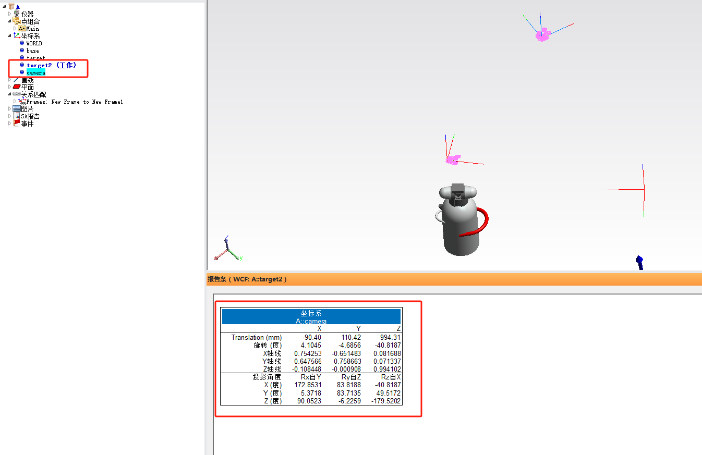
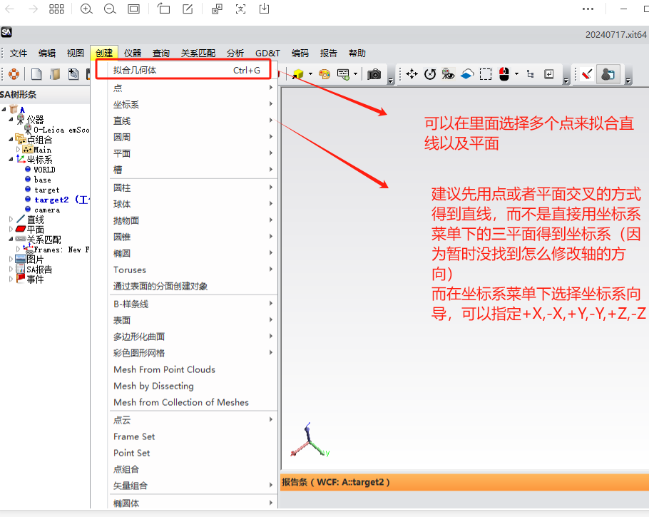
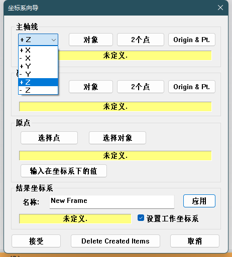
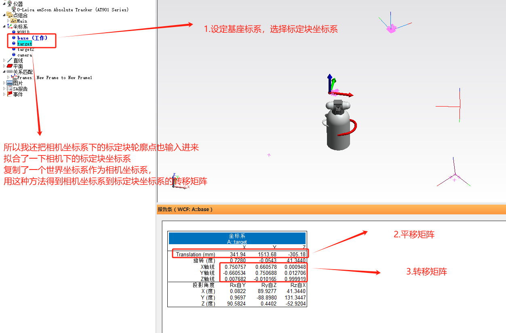
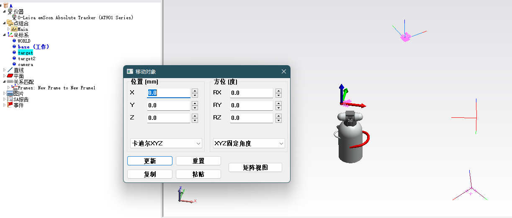
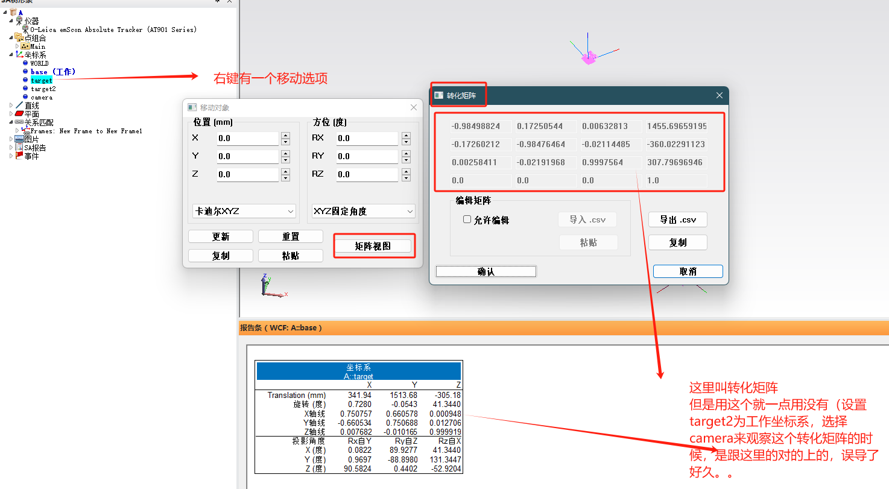

得到的转移矩阵在txt中
对实验过程做一个总结
# 实验设备
1. 激光跟踪仪的光缆有卡口，插拔前处理一下，必须注意上电和断电的顺序：电源开启，电源灯停止闪烁稳定后，开启激光跟踪仪的开关，闪烁（可能等待几分钟），在SA中添加并且连接设备，电脑设置的ip地址为
2. 
第一次连接可能有较多的问题，连接不上
3. 靶球放在激光跟踪仪上，先进行一次复位（正常初始化时会自动复位一次）
4. 然后就可以移动靶球，进行采集数据点了，注意选择合适的靶球尺寸

# SA软件中的一些功能（我今天打开的时候菜单栏和昨天不一样了，疑惑）

## 创建了需要的坐标系后，可以设置为工作坐标系，此时点击其它坐标系可以得到转移矩阵的信息

# 有坑

# 左边菜单基本上所有都可以生成快速报告导出